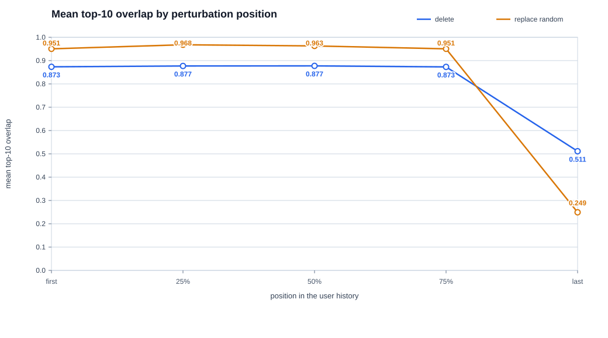

# Устойчивость рекомендаций HSTU к изменениям истории пользователя

## Что исследуется

Последовательная рекомендательная модель предсказывает следующий фильм по истории пользователя.


```text
История: Toy Story → Star Wars → Alien → Terminator 2 → The Matrix
Следующий фильм (target): Fight Club
```

Модель видит пять фильмов из истории и должна поставить `Fight Club` как можно выше среди кандидатов. Во время эксперимента следующий фильм всегда остаётся тем же.

## Как модель строит рекомендации

В эксперименте используется HSTU - модель, которая последовательно преобразует историю фильмов в описание текущих интересов пользователя. Её работу можно представить в несколько шагов.

Сначала каждый `movie ID` заменяется эмбеддингом - обучаемым вектором из 50 чисел. В начале обучения эти числа почти случайны, а затем меняются так, чтобы фильмы, встречающиеся в похожих контекстах просмотра, получали похожие представления. К эмбеддингу добавляется информация о позиции фильма, поэтому модель различает порядок взаимодействий.

Далее история дважды проходит через HSTU-блок. Блок - это один повторяемый слой обработки последовательности: для каждого фильма он объединяет информацию о самом фильме с информацией о предыдущих элементах истории. Внутри блока работает механизм внимания. Он назначает предыдущим взаимодействиям разные веса, поэтому недавний или особенно связанный с текущим интересом фильм может влиять сильнее остальных. В используемой конфигурации у внимания одна голова, то есть один набор таких весов.

Во время обучения в блоках применяется dropout `0.2`: случайная часть промежуточных признаков временно обнуляется, чтобы модель меньше запоминала обучающие примеры и лучше работала на новых пользователях. При получении рекомендаций dropout отключён.

После второго блока берётся представление последнего реального элемента истории. Оно служит итоговым вектором состояния пользователя. Этот вектор сравнивается с эмбеддингом каждого фильма-кандидата: чем выше сходство, тем выше фильм в выдаче. Уже просмотренные фильмы исключаются, а десять кандидатов с наибольшими оценками образуют Top-10.

Чтобы обучить эмбеддинги и HSTU-блоки, модель учится отличать правильный следующий фильм от 128 случайных неправильных кандидатов. Такой способ называется sampled softmax и позволяет не пересчитывать на каждом шаге все фильмы. AdamW - алгоритм, который по ошибке предсказания обновляет параметры модели. Один шаг обновления выполняется по mini-batch из 128 пользовательских последовательностей. После обучения параметры сохраняются в checkpoint; в эксперименте устойчивости этот checkpoint фиксирован и не дообучается.

## Как подготавливаются данные

MovieLens 1M содержит 1000209 оценок от 6040 пользователей. Для каждого пользователя взаимодействия с фильмами сортируются по времени: от самого раннего к самому позднему. Последний реальный фильм становится target, а все предыдущие фильмы - входной историей.

Модель принимает 200 последних взаимодействий. Если история короче, то справа добавляются нули до нужного размера. Эти нули называются padding и нужны только для объединения историй разной длины в один batch; модель не считает их фильмами.

Например, короткая история из пяти фильмов внутри тензора может выглядеть так:

```text
[Toy Story, Star Wars, Alien, Terminator 2, The Matrix, 0, 0, 0, ...]
```

Позиции `first`, `25%`, `50%`, `75%` и `last` вычисляются только по пяти реальным элементам. Padding в выборе позиции не участвует.

## Как изменяется история

Для первых 500 пользователей из test-набора изменяется ровно один фильм. Рассматриваются пять позиций: первый элемент, четверть истории, середина, три четверти и последний элемент перед target.

Используются два вида изменения.

### Удаление

Выбранный фильм полностью убирается, а последующие элементы сдвигаются влево:

```text
Было:  Toy Story → Star Wars → Alien → Terminator 2 → The Matrix
Стало: Toy Story → Star Wars →         Terminator 2 → The Matrix
```

Специальный символ удаления не вставляется. Фактическая длина истории уменьшается на единицу, а освободившееся место справа заполняется обычным padding-нулём.

### Случайная замена

Выбранный `movie ID` заменяется другим случайным id:

```text
Было:  Toy Story → Star Wars → Alien → Terminator 2 → The Matrix
Стало: Toy Story → Star Wars → Alien → Terminator 2 → You've Got Mail
```

Длина и временная позиция не меняются. Для каждой позиции выбираются пять случайных фильмов с воспроизводимыми seed. Повторения нужны, чтобы вывод не зависел от одной особенно удачной или неудачной замены.
В данной реализации случайно выбранный фильм проверяется на то, чтобы он не был target, а так же не совпадал с другим фильмом из последовательности.
Итого получено 2 500 сравнений для удаления и 12 500 сравнений для случайной замены. Все 15 000 результатов сохранены построчно в `ml1m_hstu_robustness.csv`.

## Как сравниваются рекомендации

Предположим, что до изменения и после него модель выдала следующие Top-5:

```text
Исходный список:          [A, B, C, D, E]
После изменения истории: [A, B, C, F, G]
```

В списках сохранились фильмы `A`, `B` и `C`.

**Top-K overlap** отвечает на вопрос: какая доля исходного списка сохранилась? В примере совпали 3 фильма из 5, поэтому overlap равен `3 / 5 = 0.6`. Значение `1` означает полное совпадение списков, а `0` - отсутствие общих фильмов.

**Jaccard index** также использует пересечение, но делит его на число всех различных фильмов в двух списках. В примере общих фильмов 3, а различных 7 (`A, B, C, D, E, F, G`), поэтому Jaccard равен `3 / 7 ≈ 0.43`.

**Jensen-Shannon divergence**, или JS divergence, смотрит шире Top-K. Модель присваивает оценки всем доступным фильмам, и после softmax эти оценки можно рассматривать как распределение вероятностей. JS показывает, насколько изменилось всё распределение: значение около нуля означает почти одинаковое поведение модели, а большее значение - заметное перераспределение вероятностей. Для удобства чтения на графиках JS умножена на 1000.

**Top-1 changed** показывает, сменился ли фильм на первом месте. В примере первым остался `A`, поэтому значение равно `False`.

**Target rank delta** показывает, как изменилась позиция правильного следующего фильма. Например, если target опустился с 4-го на 12-е место, delta равна `+8`; положительное значение означает ухудшение. **Target@10 after** показывает долю случаев, в которых target после изменения всё ещё находится среди первых десяти рекомендаций.

Эти метрики дополняют друг друга:
1. Overlap и Jaccard показывают изменение списка первых 10 рекомендованных фильмов 
2. Top-1 фиксирует изменение первого рекомендованного фильма 
3. JS оценивает всё распределение 
4. Target rank отслеживает изменение ранга target фильма.

## Что получилось



График показывает среднюю долю совпавших рекомендаций. Чем ближе значение к `1`, тем устойчивее выдача.

| Изменение | Позиция | Top-10 overlap | Top-1 изменён | Target@10 после |
|---|---|---:|---:|---:|
| удаление | первая | 0.873 | 21.4% | 30.2% |
| удаление | последняя | 0.511 | 73.6% | 24.0% |
| случайная замена | первая | 0.951 | 6.5% | 30.5% |
| случайная замена | последняя | 0.249 | 89.2% | 12.8% |

### Основные наблюдения:

1. Изменения в начале и середине истории обычно мало влияют на Top-10: большая часть рекомендаций сохраняется.
2. Последний фильм влияет значительно сильнее. После его удаления сохраняется примерно половина Top-10, а первая рекомендация меняется почти в трёх случаях из четырёх.
3. Случайная замена последнего фильма ещё разрушительнее удаления. Она не только убирает реальный недавний сигнал, но и добавляет ложный. В среднем сохраняются лишь 2-3 рекомендации из 10.
4. Рост JS divergence для последней позиции показывает, что меняется не только видимая десятка, но и общая уверенность модели по всем кандидатам.
5. Правильный следующий фильм также страдает: его попадание в Top-10 снижается с исходных 29.75% до 24.0% после удаления последнего элемента и до 12.8% после случайной замены.
6. Величина изменения рекомендаций зависит от того, как определяется случайная замена. В текущем эксперименте заменяющий фильм не может совпадать с target или с фильмами из исходной истории. Это предотвращает искусственное маскирование target и появление повторов, но ограничивает случайный выбор и может влиять на метрики. При этом изменяется только movie ID: позиция и время взаимодействия остаются прежними. Поэтому эксперимент оценивает влияние идентичности фильма при фиксированной временной структуре истории. 

Главный вывод состоит в том, что HSTU проявляет **повышенную чувствительность к последним взаимодействиям**. Изменения в начале и середине истории почти не влияют на рекомендации, а изменение последнего фильма меняет их значительно сильнее.
Полные таблицы, распределения и дополнительные графики находятся в `outputs/robustness/plots/robustness_plots.html`.
